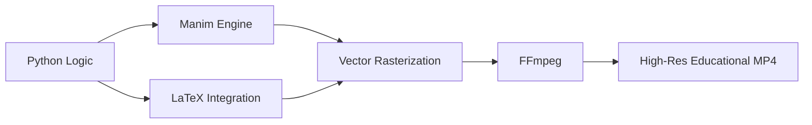

[](https://python.org)
[](https://manim.community/)
[]()
[]()

# 📐 Skillbanc Educational Animations (Manim)

### Comprehensive K-8 Mathematics Curriculum Visualizations

*A repository containing programmatic animation scripts built using 3Blue1Brown's Manim library. I developed the K-8 Mathematics Curriculum animations during my internship at **Skillbanc**.*

---

## 📋 Table of Contents

- [🚀 What This Project Does](#-what-this-project-does)
- [👩‍💻 My Contributions](#-my-contributions)
- [🏗️ Architecture](#%EF%B8%8F-architecture)
- [📁 Project Structure](#-project-structure)
- [⚡ Quick Start](#-quick-start)
- [📦 Dependencies](#-dependencies)

---

## 🚀 What This Project Does

During my internship at Skillbanc, I contributed to a massive repository of programmatic video generation scripts. Utilizing **Manim** (Math Animation Engine), these scripts compile Python logic into 60fps, 4K resolution `.mp4` files. 

While the broader repository (provided by Skillbanc) contains over 150+ scripts covering various topics including Cloud Computing, my specific focus and contribution was engineering the visualizations for the **K-8 Mathematics Curriculum**.



---

## 👩‍💻 My Contributions

My code is specifically identifiable in the `Source/` directory by the `Grade...` prefix. I built these scripts from scratch to visualize abstract mathematical concepts for young learners:

- **Elementary Math:** Numbers, Money, Basic Lengths (e.g., `Grade1Chapter15Money.py`, `Grade2Chapter13LengthofThings.py`).
- **Middle School Math:** Whole Numbers, Operations, Divisibility Rules (e.g., `Grade6Chapter2Wholenumbers.py`).
- **Advanced Concepts:** Playing with Numbers and algebraic foundations (e.g., `Grade8Chapter15PlayingWithNumbers.py`).

---

## 🏗️ Architecture

### 1. Scene Construction
Each animation inherits from `Scene` or specialized sub-classes (like `MovingCameraScene`). 
- **Object Definition:** Generating Mobjects (Mathematical Objects) like polygons, vectors, and text nodes.
- **Animation Execution:** Using `.play()` routines (`Transform`, `Write`, `FadeIn`) to dictate frame-by-frame rendering logic.

### 2. LaTeX Integration
Complex equations are parsed through a local LaTeX engine, compiled into vector paths, and injected directly into the scene coordinates, ensuring infinite scalability without pixelation.

---

## 📁 Project Structure

```text
manim-animation-templates/
├── Source/
│   ├── Grade1...Grade8 scripts  # ✨ My K-8 Curriculum contributions
│   ├── IAMServiceAnimation.py   # Skillbanc provided architecture animations
│   ├── ...                      # (150+ total Python scripts)
├── README.md                    # This documentation
└── LICENSE                      # Repository license
```

---

## ⚡ Quick Start

### 1️⃣ Clone & Setup

```bash
git clone https://github.com/MedhaMasanam/manim-animation-templates.git
cd manim-animation-templates
```

### 2️⃣ Install Manim & Dependencies

*Note: Manim requires FFmpeg and LaTeX installed on your system. Refer to the [official Manim installation guide](https://docs.manim.community/en/stable/installation.html) for OS-specific instructions.*

```bash
pip install manim
```

### 3️⃣ Render an Animation

To render one of my specific curriculum modules (e.g., Grade 6 Whole Numbers) in high quality (1080p, 60fps), run:
```bash
manim -pqh Source/Grade6Chapter2Wholenumbers.py WholenumbersScene
```
*(Note: Replace `WholenumbersScene` with the specific class name inside the python script).*

The output `.mp4` file will be generated in a `media/videos/` directory automatically.

---

## 📦 Dependencies

| Package | Purpose |
|---------|---------|
| `manim` | Core animation library and rendering engine |
| `ffmpeg` | Background video compilation and encoding |
| `latex` | Mathematical equation parsing and rendering |

---
**Curriculum developed by Medha Masanam during Skillbanc Internship**  
[]()
